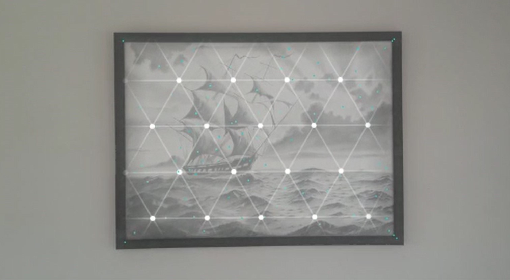
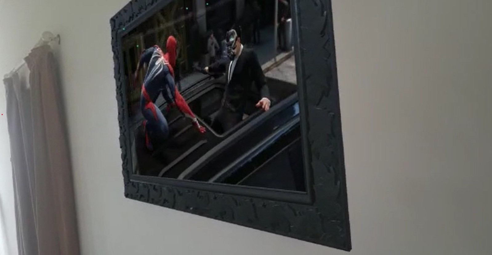

# WALL TV-AR
A Unity based AR android application that puts a resizable and rotatble video screen on any textured flat surface.

 

   
 

# App Instructions
  - Download and install “AR WALL TV.apk” from this repo on any android phone (with android 7 or above). Note that you might need to allow app installations from unknown sources in android settings if you are facing issues installing the app.
  - Start the app.
  - Face towards any wall (or plane) with descent texture.
  - Tap the screen to select the plane (and anchor the scene).
  - Pinch and slide the screen for rescaling and rotating if the default orientation is non-satisfactory.
  - ENJOY!!!
  
# Some Pics
A framed sketch was taken as an anchor for the pics below.

  
# Technologies Used
  - Unity 2018.2.12f1 (C# scripts)
  - Unity XR Toolkit (For AR/VR Libraries of Unity)
  - Unity ARCore (For AR experience on Android)
